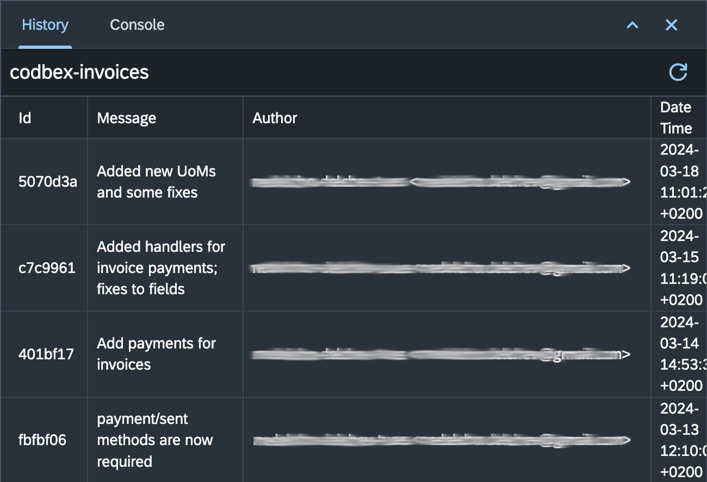

# Git History

The "History" view in the Git perspective provides a detailed and interactive visualization of your Git repository's commit history. This section provides an overview of the key features and actions available in the "History" view.

{: style="width:500px"}

## Exploring Git History

1. **Open the Git History View:**
   - To open the Git History view, navigate to the Git perspective and select "History".

2. **Visualize Commit History:**
   - The Git History view displays a tabular representation of your Git repository's commit history, showing branches, merges, and commits.

3. **Interactive Graph:**
   - Interact with the table to explore commit details, branches, and the flow of changes over time.

4. **Detailed Commit Information:**
   - Click on a commit row in the table to view detailed information, including the commit message, author, timestamp, and changes made.

5. **Filter by Author, Date, or Branch:**
   - Use the available filters to narrow down the commit history based on the author's name, date range, or specific branches.

## Actions in the Git History View

### 1. **Refresh Git History:**
   - Use the "Refresh" button in the Git History toolbar to update the visual representation of the commit history.

## Conclusion

The "History" view in the Git perspective provides an intuitive and tabular representation of your Git repository's commit history. Explore the interactive table, use filters, and leverage the available actions to gain insights into the evolution of your codebase.
